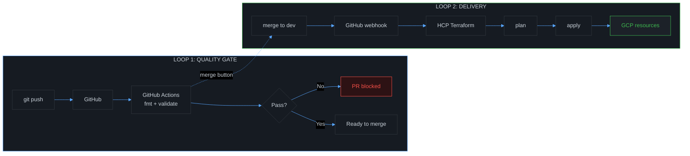
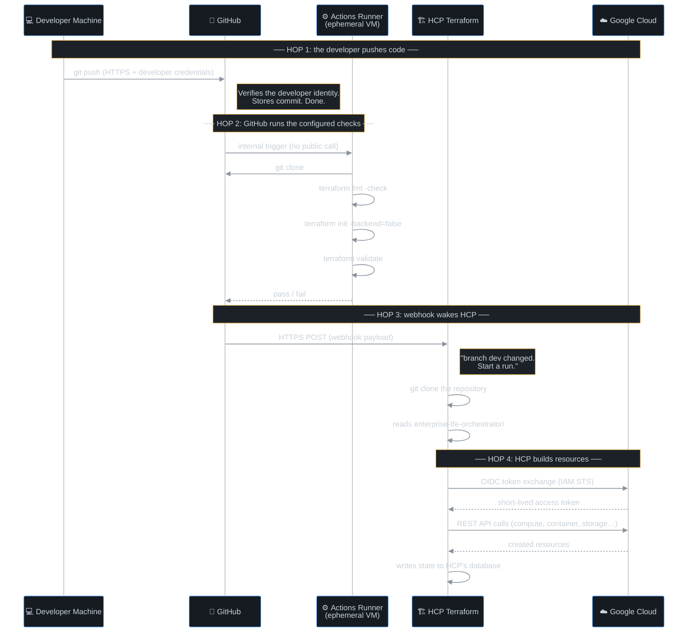
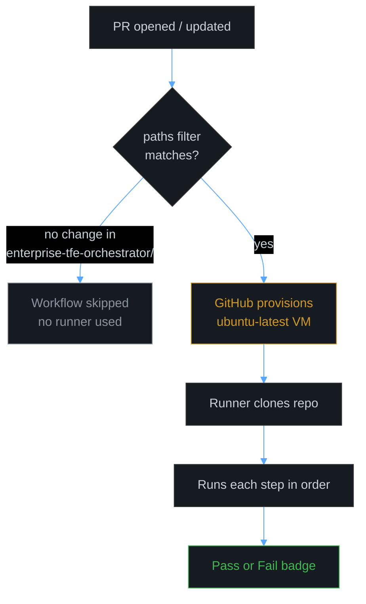
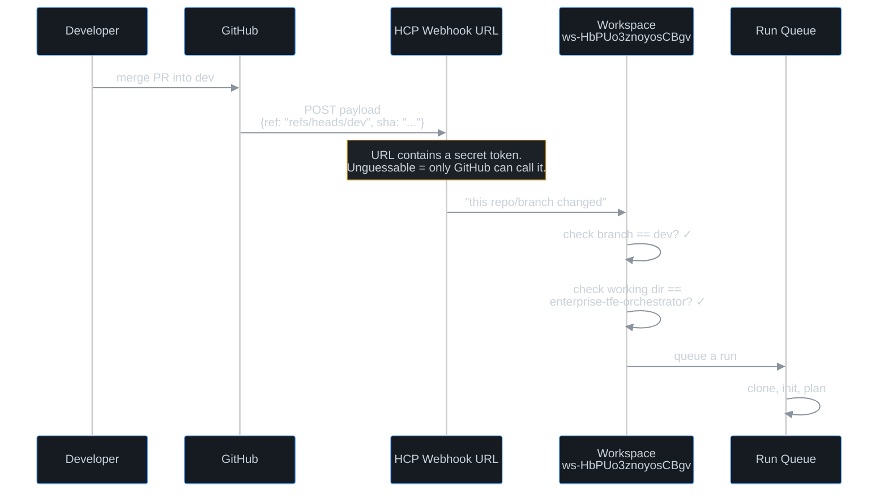
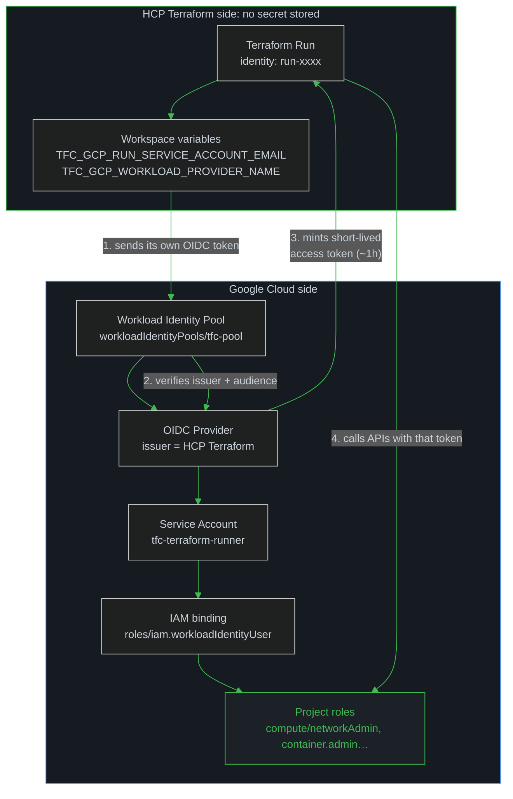
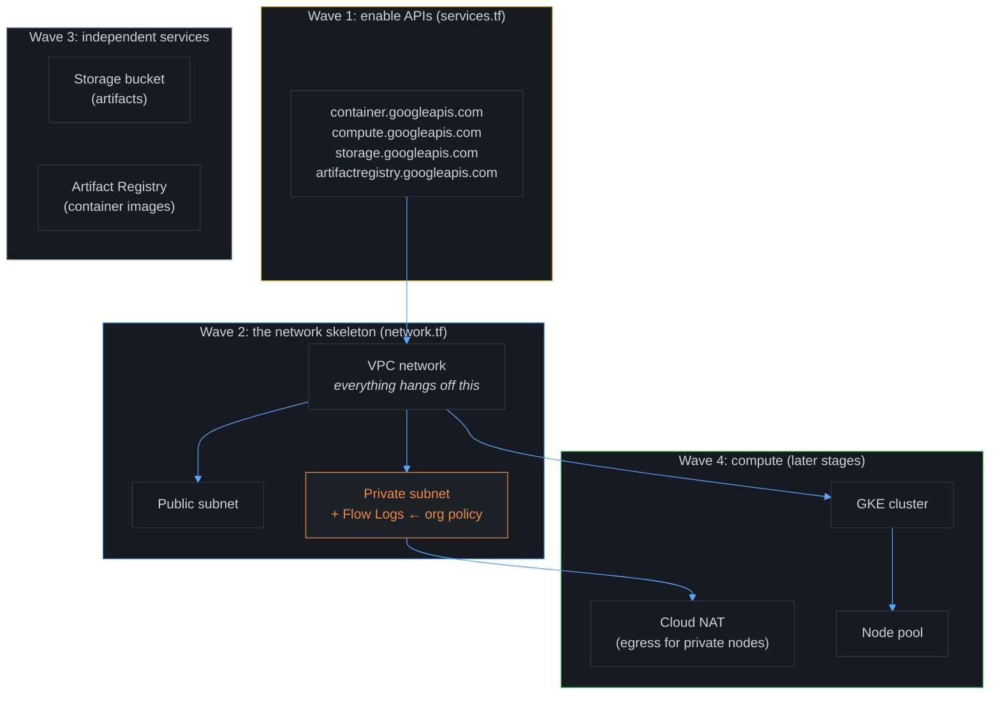
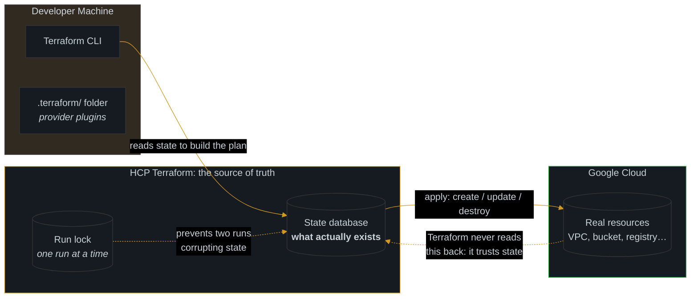
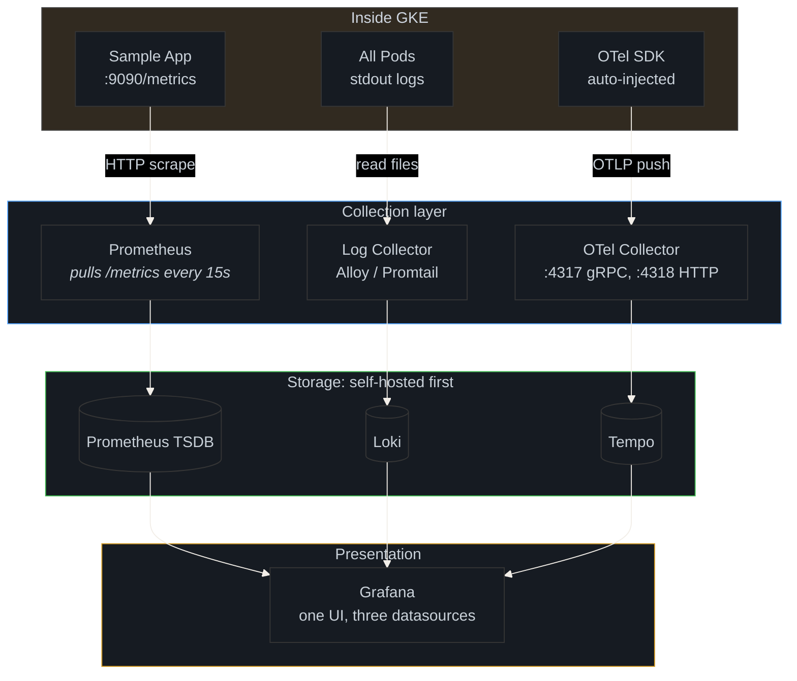

# Platform Delivery Chain

How a file edited on a developer workstation becomes a running resource inside Google Cloud.

This document walks through the full path: every machine, every network call, and
every authentication step in between. I have written it to be read in order, because
each layer only makes sense once the previous one is clear. Nothing here is magic;
each piece exists for a reason, and I explain that reason as we go.

---

## ★ The one idea that fixes most confusion

There are **two independent loops**, not one chain. Separating them is the single
most useful thing a reader can take from this document, because it explains why
a passing CI run and a running cloud environment are two different facts.

> **The misconception this section corrects:** it is natural to assume that a
> successful GitHub Actions run is what *deploys* the infrastructure. It is not.
> Actions only **validates** code. The infrastructure is created by HCP Terraform,
> which GitHub wakes with a **webhook** after a merge. Two separate systems, and
> neither one drives the other.

---

## The four hops, in order

The chain breaks into four hops. Each hop answers a different question: *how does
the code travel*, *who checks it*, *who decides to run*, and *who builds it*.

---

## Hop 1: Developer's machine → GitHub

| Question | Answer |
|---|---|
| **What travels?** | The `.tf` files, compressed inside a Git packfile |
| **Over what?** | HTTPS to `github.com` (port 443), TLS-encrypted |
| **How is the author identified?** | A credential helper (OS keychain) or an SSH key. GitHub verifies it, then trusts the push. |
| **What lands on GitHub?** | An immutable **commit** object. Nothing is executed. |

**Key point:** at this stage GitHub is purely a *version store*. It holds the code
and does nothing else with it. Execution happens strictly downstream.

---

## Hop 2: GitHub → Actions (the part that surprises people)

**What actually happens:**

1. GitHub **internally** registers the PR event. No internet call is involved;
   this is GitHub's own event bus, entirely inside their infrastructure.
2. The `paths:` filter is evaluated. If the workflow cannot be affected by the
   change, it is **skipped without consuming a single second of compute**.
3. GitHub provisions a **throwaway virtual machine** (`ubuntu-latest`). The code
   executes here, not on any developer's machine, and not on HCP Terraform.
4. That VM is **destroyed** when the job finishes. Nothing persists.

> **Why this separation is a security property, not a formality:** the Actions
> runner holds its own copy of the code and access to repository secrets. It is
> deliberately isolated from the deployment path. That isolation is precisely what
> makes it acceptable for CI to have read access while the CD system holds the
> write credentials.

---

## Hop 3: GitHub → HCP Terraform (the webhook)

This hop is the one most explanations skip, and it is the one that answers the
question *"how does the platform even know the code changed?"* The answer is a
**webhook**, not a pipeline.

**The mechanism:**

**The three workspace settings that make this work:**

| Setting | Value | Why it exists |
|---|---|---|
| **Watched branch** | `dev` | Merges to `main` never trigger anything |
| **Working Directory** | `enterprise-tfe-orchestrator` | Enables a monorepo: every other folder in the repository is invisible to Terraform |
| **Apply Method** | `Auto apply` | Removes the manual "Apply" click after a successful plan |

> ★ **The Working Directory is the most consequential setting in the whole setup.**
> It is what allows Terraform, GitOps, and application code to share a single
> repository without interfering with one another. Terraform only ever reads
> `enterprise-tfe-orchestrator/`, and is structurally unable to see the rest.

---

## Hop 4: HCP Terraform → Google Cloud

This setup authenticates **without a stored key**, using keyless identity. It is the
most important section in this document, because this is precisely where a
long-lived credential is most often introduced by mistake, and then leaked.

### The credential chain

**In plain English:**

1. HCP Terraform asserts: *"this is a legitimate run, and it claims to act as this
   service account."* It proves the claim with a cryptographically signed token,
   no password, and no key file anywhere.
2. Google verifies three separate things: *is the issuer genuinely HCP Terraform?
   is the audience my identity pool? does the token's subject match the service
   account that was bound?*
3. Only if all three match does Google issue a **temporary access token**, valid
   for roughly one hour.
4. Terraform uses that token to call the GCP APIs. When the run finishes, the
   token simply expires and ceases to work.

> ★ **The security property:** there is **no key file anywhere in this design**.
> Nothing to leak, nothing to rotate, nothing to commit to Git by accident.
> Contrast this with the older pattern of downloading a `credentials.json`:
> that file is a permanent password in plaintext, and eliminating it is the entire
> reason this architecture exists.

### The environment variables doing the work

| Variable | Value | Meaning |
|---|---|---|
| `TF_CLI_ARGS_plan` | `-var-file=config/dev.tfvars` | "Every plan and apply reads answers from this file" |
| `TFC_GCP_PROVIDER_AUTH` | `true` | "Use dynamic credentials, not a static key" |
| `TFC_GCP_PRINCIPAL_TYPE` | `service_account` | "The identity is a service account" |
| `TFC_GCP_RUN_SERVICE_ACCOUNT_EMAIL` | the SA email | *Which* service account to impersonate |
| `TFC_GCP_WORKLOAD_PROVIDER_NAME` | `projects/…/providers/…` | *Where* to verify the token |

> **Note what is absent:** there is no `GOOGLE_CREDENTIALS` variable. That absence
> *is* the security property: there is no stored secret for an attacker to steal.

---

## What happens inside GCP: creation order

Terraform does not create resources in the order they appear in the source files. It
first builds a **dependency graph**, then creates parents strictly before children.

**Why this order is forced:**

| Resource | Must exist first | Reason |
|---|---|---|
| APIs | n/a | Everything else calls these |
| VPC | APIs | Cannot create a network in a project without the API |
| Subnet | VPC | A subnet is *inside* a network |
| Cloud NAT | Private subnet | NAT attaches to a specific subnet |
| GKE cluster | VPC + subnet | The cluster's nodes must land in a subnet |
| Node pool | GKE cluster | A node pool is a child of a cluster |

> **A real failure from this project demonstrates the principle.** During the build
> of this environment, the private subnet was rejected with
> `Error 412: Constraint constraints/compute.requireVpcFlowLogs violated`. The
> organisation policy inherited by this project *requires* flow logs on every
> subnet; Terraform attempted to create the subnet without them and GCP refused.
>
> **The correct response to a guardrail is to satisfy it, never to disable it.**
> Adding Flow Logs at 100% sampling brought the configuration into compliance
> without weakening a control the platform team owns. Removing the policy would
> have been faster and would have silently degraded a security boundary.

---

## State: the concept most explanations omit

> ★ **The rule that prevents the majority of infrastructure incidents:**
> **State behaves like a cache, but it is an authoritative one.** Terraform decides
> what to do by comparing *the configuration* against *state*, **not** against live
> reality. If a resource is deleted by hand in the GCP console, state still records
> it as existing, and Terraform's next plan becomes incorrect.
>
> For this reason, `terraform apply` must never be run from a developer machine
> against this project. State lives in HCP Terraform. Two writers means
> corruption.

---

## Current state of the environment

The following reflects what has already been provisioned, what comes next, and what
is planned for later stages.

```mermaid
%%{init: {"theme":"base","themeVariables":{"darkMode":true,"background":"#0d1117","primaryColor":"#161b22","primaryTextColor":"#c9d1d9"}}}%%
flowchart LR
    subgraph DONE["✅ Built"]
        D1["dev branch"]
        D2["HCP org + workspace<br/>ws-HbPUo3znoyosCBgv"]
        D3["WIF identity<br/>(pool, provider, SA)"]
        D4["bootstrap-tfc-gcp.sh"]
        D5["VPC + 2 subnets"]
        D6["Storage bucket"]
        D7["Artifact Registry"]
        D8["Actions workflow"]
    end

    subgraph NEXT["⏭️ Next"]
        N1["Cloud NAT"]
        N2["GKE cluster"]
        N3["Node pool"]
    end

    subgraph LATER["📦 Later"]
        L1["GKE via Terraform"]
        L2["Flux bootstrap"]
        L3["kube-prometheus-stack"]
        L4["Loki + Tempo"]
        L5["Grafana access"]
        L6["Sample app + traces"]
    end

    DONE ==> NEXT ==> LATER

    style DONE fill:#0f2417,stroke:#3fb950,color:#c9d1d9
    style NEXT fill:#1c2128,stroke:#d29922,color:#c9d1d9
    style LATER fill:#161b22,stroke:#8b949e,color:#8b949e
```

---

## The destination: the full observability stack

This is where the platform is heading, and how the individual components will
communicate once the cluster is running.

**The three data types, and why they move differently:**

| Type | Direction | Transport | Why different |
|---|---|---|---|
| **Metric** | Prometheus **pulls** from the app | HTTP `/metrics` | Cheap, stateless, can be retried |
| **Log** | Collector **pushes** to storage | Loki push API | High volume, must not block the app |
| **Trace** | App **pushes** to collector | OTLP (gRPC/HTTP) | Context must survive across services |

> **Why metrics are pulled while logs and traces are pushed:** a failed metric
> scrape is harmless: it simply produces a gap in the data. But if log shipping
> blocked an application response, the application itself would degrade. Logs and
> traces are therefore always fire-and-forget, pushed asynchronously, so that
> observability can never become an availability risk. This asymmetry is a
> deliberate design decision, not an accident.

---

## The three tools, side by side

| Tool | Owns | Triggered by | Runs on | Touches GCP? |
|---|---|---|---|---|
| **GitHub Actions** | Code quality | PR opened/updated | Ephemeral VM | ❌ Never |
| **HCP Terraform** | Infrastructure | Webhook from `dev` | HCP's workers | ✅ Creates/deletes |
| **Flux** | In-cluster state | Polls Git every 1 to 10 min | Inside the cluster | ✅ Via K8s API only |

> **Flux is deliberately absent from the two loops above.** It operates on an
> entirely separate path: it never passes through GitHub Actions or HCP Terraform.
> It reads Git on its own schedule and communicates directly with the Kubernetes
> API. Once the GitOps stages are reached, this separation is what prevents the
> three systems from interfering with one another.

---

## Vocabulary quick-reference

| Term | One-line meaning |
|---|---|
| **Commit** | An immutable snapshot of your files |
| **PR** | A request to merge one branch into another |
| **Workflow** | A YAML file describing automated checks |
| **Runner** | The throwaway VM that executes a workflow |
| **Webhook** | An HTTPS callback that tells another system "something changed" |
| **Plan** | A dry run: "here is exactly what I would change" |
| **Apply** | Actually making those changes |
| **State** | Terraform's record of what it believes exists |
| **Provider** | The plugin that knows how to talk to a cloud |
| **OIDC / WIF** | Keyless login: prove who you are with a token, not a password |
| **Dynamic credentials** | A temporary access token, minted per run, auto-expiring |

---

## Comprehension check

The following questions are useful for confirming the material has been absorbed. A
reader who can answer all five has understood the delivery chain end to end.

- [ ] Can you explain why GitHub Actions does **not** trigger the deployment?
- [ ] Can you name the four hops, and the distinct role of each?
- [ ] Do you know which single workspace setting makes the monorepo possible?
- [ ] Can you explain why state must never be written from two places?
- [ ] Can you explain why metrics are pulled while logs and traces are pushed?

---

## Related

- [[02-terraform-resource-map]]: every `.tf` file and what it creates
- [[03-gitops-flux-flow]]: the Flux reconciliation loop (following the bootstrap)
