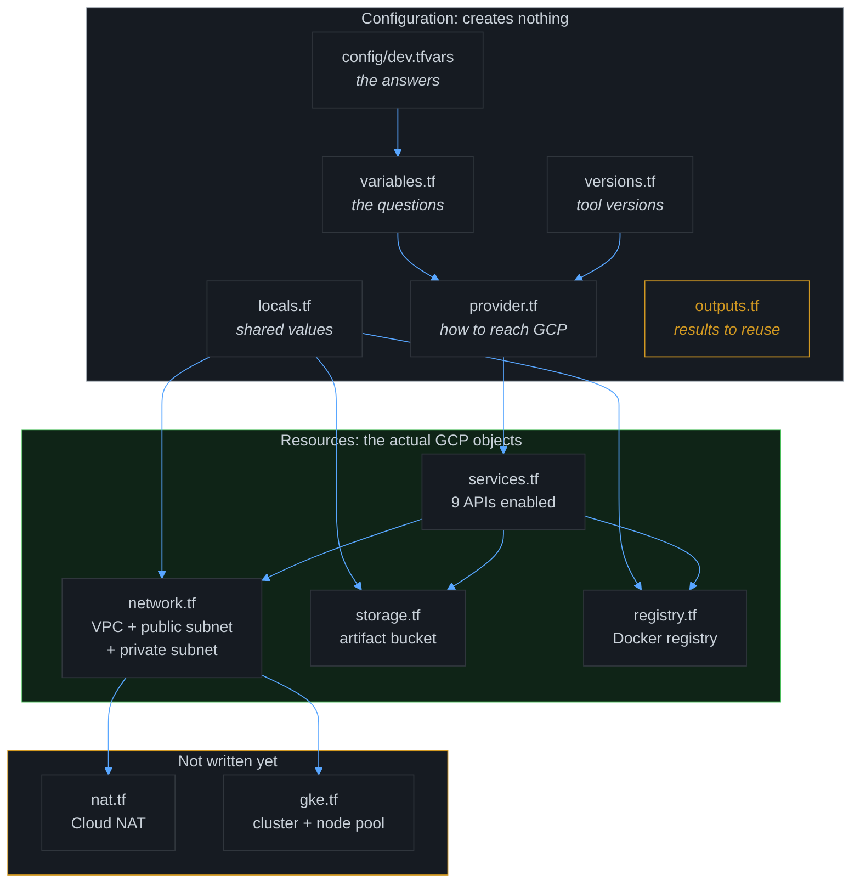
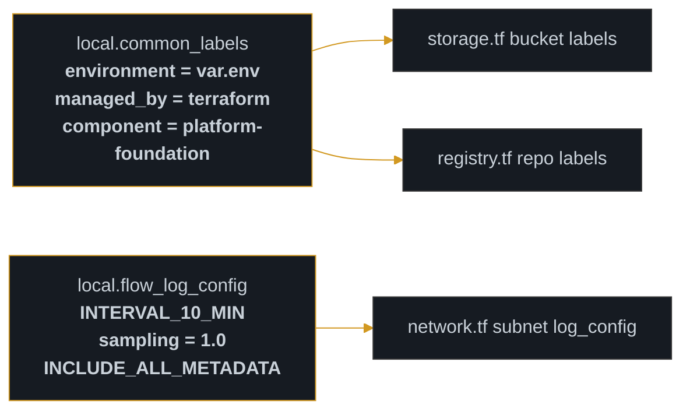
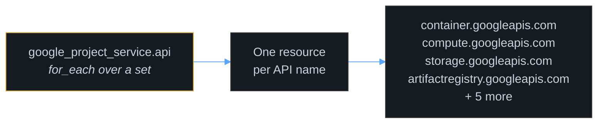
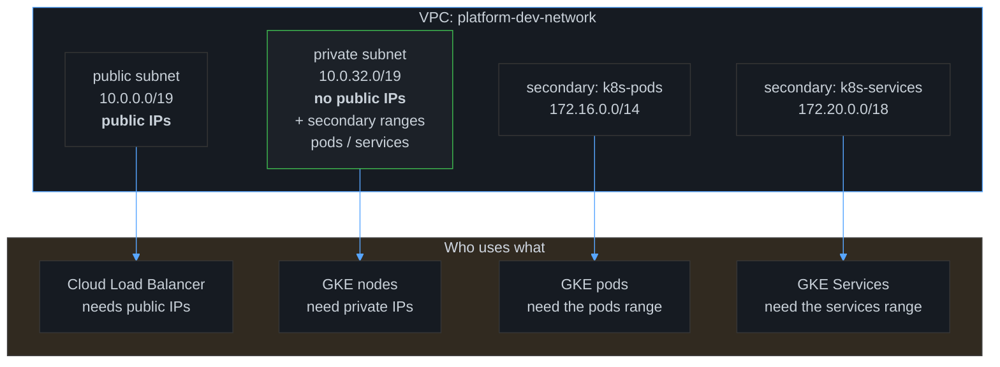

# Terraform Resource Map

This document walks through every `.tf` file in
`enterprise-tfe-orchestrator/platform-foundation/`, explains the resource each one
creates, and sets out why that resource has to exist before the ones that depend
on it.

Readers should work through [[01-delivery-chain]] first, since this document assumes
familiarity with the two-loop model: GitHub Actions validating, HCP Terraform
deploying.

---

## The files, in dependency order

Terraform disregards the order in which these files are read. It constructs a
dependency graph and creates parents ahead of children. The listing below reflects
that graph order rather than the file order.



> **The organising principle:** `versions / provider / variables / locals / outputs`
> describe *how the work is carried out*. `services / network / storage / registry`
> describe *what is actually built*. Only the second group reaches Google Cloud.

---

## File by file

### `versions.tf`: the tool contract

Declares the Terraform version range and which provider plugin to download. Creates
**nothing**.

**Why it matters:** the `>= 6.0, < 8.0` bound prevents a future provider major
version from silently altering resource behaviour underneath a working
configuration. The reference implementation pins to `>= 7.0, < 8.0`, the same
principle at a different major version.

**What was deliberately omitted:** a `cloud {}` block. The reference implementation
runs on Terraform Enterprise, so its code carries a `cloud {}` block instructing TFE
to hold state. **HCP Terraform rejects that block**: the portal already owns the
workspace, so declaring it in code is both redundant and an error. This is the single
largest structural difference between the two approaches.

---

### `provider.tf`: the connection

One block, bound to `var.project_id` and `var.gcp_region`. Creates **nothing**.

**Why so much smaller than the reference:** that implementation declares three
provider blocks: a second aliased `special` provider and a `google-beta`, all
resolved through `module.project.project.project_id`. This is necessary there because
an internal module *creates* the GCP project itself. **This environment already has
its project provisioned** (`mms-clp-playground-1790326573`), so there is no
project-creating module to wire into, and a single provider block is sufficient.

---

### `variables.tf`: the questions

Five variables, split into required and optional.

| Variable | Type | Required? | Purpose |
|---|---|---|---|
| `project_id` | string | ✅ | Which GCP project |
| `gcp_region` | string | ✅ | Default region |
| `env` | string | ✅ | `dev` or `prod`, with a validation block |
| `k8s_cluster_name` | string | ❌ | Cluster name, defaults to `lab-cluster` |
| `k8s_node_pools` | map(object) | ❌ | Node pool definitions, defaults to `{}` |
| `secret_manager_secrets` | map(list(string)) | ❌ | Secret envelope names, defaults to `{}` |

**The `validation` block deserves attention:**

```hcl
variable "env" {
  type = string
  validation {
    condition     = contains(["dev", "prod"], var.env)
    error_message = "env must be either dev or prod."
  }
}
```

Without it, a typo such as `env = "devv"` would pass validation and surface much
later as a half-built environment. With it, Terraform halts immediately and emits a
message that identifies the problem directly.

**What was deliberately omitted:** `folder_ids`, `org_group`, `billing_account`,
`tfe_workspace_id`, and `ref_uuid`. These are declared in the reference repository
solely because **TFE injects them** as workspace variables. HCP Terraform manages
state independently, so nothing needs to be declared. A smaller variable surface
means fewer opportunities for misconfiguration.

---

### `locals.tf`: the shared values

Local values are Terraform's private scratchpad: computed once, referenced from many
places, never sent to GCP as a resource.



**Why this matters:** a single definition is now the single point of change, and it
propagates to every consuming resource. Three separate label blocks would drift out
of alignment over time.

> **Naming discipline:** `environment`, `managed_by`, and `component` are generic
> labels. They carry no company, product, or platform name. The constraint that this
> environment contains no proprietary identifiers is therefore satisfied by design,
> rather than by later cleanup.

---

### `services.tf`: the unlock

Enables the GCP APIs the resources in this module require. Creates **service
enablements**, not compute.

**Why it must come first:** every other resource calls an API. With the API
disabled, the call fails with an ambiguous "permission denied" or "API not enabled"
message rather than a clear dependency error. Declaring them in Terraform makes the
prerequisite *declarative*, rather than a manual action someone has to remember.



**The `for_each` pattern:** one resource *block* producing many *instances*. This
is how Terraform removes duplication. The reference repository's `locals.tf` lists
roughly 50 API names in an array, the same principle applied at a larger scale.

---

### `network.tf`: the skeleton

Three resources: one VPC, one public subnet, one private subnet.



**Why two subnets instead of one:**

| | Public subnet | Private subnet |
|---|---|---|
| External IP | ✅ Yes | ❌ No |
| Reachable from internet | ✅ Yes | ❌ No |
| Holds | Load balancers, public services | GKE nodes, private backends |

Separating them means a compromised backend has **no route to the internet** and
cannot be reached from it. That is defence in depth, not decoration.

**The secondary ranges explained:** Kubernetes does not allocate Pod addresses from
the VPC range. Pods draw from a *separate* address pool, which is why the subnet
declares three ranges:

| Range | Purpose | Consumed by |
|---|---|---|
| `10.0.32.0/19` | The nodes themselves | GKE node VMs |
| `172.16.0.0/14` | Pod IPs | Every Pod in the cluster |
| `172.20.0.0/18` | Service/virtual IPs | Every `Service` object |

> ★ **A real constraint encountered while building this environment.** The project
> inherits `constraints/compute.requireVpcFlowLogs`, an organisation policy that
> *requires* flow logs on every subnet. The initial private subnet carried no
> `log_config`, and GCP rejected it with
> `Error 412: Constraint violated`.
>
> **The correct response to a guardrail is to comply with it, not to disable it.**
> Enabling Flow Logs at 100% sampling satisfies the policy at every documented level
> (ESSENTIAL, LIGHT, COMPREHENSIVE). Disabling the policy would have been faster and
> would have removed a security control owned by another team.

---

### `storage.tf`: the artifact landing pad

A Cloud Storage bucket for build outputs and reports.

Key attributes: `uniform_bucket_level_access = true` (blocks per-object ACLs, forces
IAM), `force_destroy = false` (a mistyped apply cannot delete the data it holds), and
`labels = local.common_labels`.

**Why `force_destroy = false` matters:** set it to `true` and a `terraform destroy`
wipes the bucket immediately. Set it to `false`, and Terraform marks the bucket for
deletion while leaving the data intact until the deletion is confirmed. This is the
correct default for anything holding build artifacts.

---

### `registry.tf`: where container images live

An Artifact Registry repository in `DOCKER` format. This serves as the private
equivalent of Docker Hub, and is where the sample application image is pushed.

**Why not Docker Hub:** Docker Hub is a public service carrying rate limits and
offering no IAM integration. Artifact Registry is scoped to the project, so the same
service account that executes Terraform can also push images, with no second set of
credentials required.

---

### `outputs.tf`: the results worth knowing

Outputs print values after an apply. The most useful ones at this stage:

| Output | Why it matters |
|---|---|
| Network name / self-link | Input for the NAT and GKE files that follow |
| Bucket name | Reference when configuring the CI workflow |
| Registry URL | The exact `image:` prefix CI will push to |
| Project ID | Confirmation that the correct project was targeted |

---

## Resource count to date

The workspace recorded **25 resources created, 1 blocked**.

| File | Resources | Status |
|---|---|---|
| `services.tf` | 9 | ✅ Created |
| `network.tf` | 4 (VPC + 2 subnets + route) | ⚠️ 3 created, 1 blocked → now fixed |
| `storage.tf` | 2 (bucket + IAM) | ✅ Created |
| `registry.tf` | 1 | ✅ Created |
| `locals.tf` | 0 | Local values only |
| `versions / provider / variables / outputs` | 0 | Configuration only |

> Once the Flow Logs change is applied, the previously blocked private subnet should
> appear and the total should reach **26**. If it does not, the run log identifies
> precisely which resource failed and why.

---

## Vocabulary quick-reference

| Term | One-line meaning |
|---|---|
| **Resource** | A real thing in GCP that Terraform manages |
| **Local** | A computed value used only inside your own code |
| **Output** | A value exported for other code or humans to read |
| **`for_each`** | Create one instance per item in a collection |
| **`count`** | Create N identical instances (less flexible than `for_each`) |
| **`depends_on`** | Force ordering, to be used only when data flow is not sufficient |
| **Data source** | *Read* something that exists, create nothing |
| **Uniform bucket access** | IAM-only bucket permissions, no per-object ACLs |
| **Flow Logs** | Metadata records of who talked to what inside your VPC |
| **Secondary range** | An extra IP pool on a subnet, used for Pods and Services |

---

## Comprehension check

These questions confirm the material has been absorbed. A reader who can answer all
five has a working grasp of the Terraform layout.

- [ ] Can you name the five files that create **zero** resources?
- [ ] Do you know why the reference implementation's `provider.tf` is three times larger?
- [ ] Can you explain all three secondary ranges on the private subnet?
- [ ] Do you know why `force_destroy = false`?
- [ ] Can you explain why complying with the Flow Logs policy was the correct response to the 412?

---

## Related

- [[01-delivery-chain]]: how code becomes infrastructure
- [[03-gitops-flux-flow]]: the Flux reconciliation loop (following the bootstrap)
